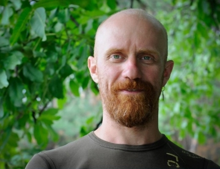

# **Oleksandr Kulkov**

#### Trainee Frontend Developer

---

### **Contact information**

**My Discord RS School server nick:**
OleksandrKulkov

from Kyiv, Ukraine

**Phone:** +380 50 7355445

**email:** <hutofsato@gmail.com>

**Telegram:** [@hutofsato](https://t.me/hutofsato "My Telegram")

---

### **About myself:**

**Work experience:**

_2012-02/2022_ - Private entrepreneur–tea school (my own educational project) and a small online tea shop with unique tea. I created [my first website](https://teahut.com.ua) on Joomla CMS for them in 2014.

_2001-2012_ - Private entrepreneur–DJ, photographer, videographer (corporate sector).

_2001-2004_ - Sound engineer–film dubbing on Kyiv Dovzhenko Film Studio.

**Personal qualities:**
responsible, decent, daring, easy-going. I am a "diver" in my studies and work—I can easily delve into details and I try to understand the essence. I think critically and plan realistically.

**Hobby, free time:**
Tea ceremony, meditation, music, photography, and I like reading very much (maybe 50 books a year).

---

### Skills and Proficiency

- HTML5 and CSS (basic, with SASS/SCSS)

- Javascript (basic)

- React (basic)

- Git (basic)

- VSCode

- Mac OS, Windows

---

### Code Example:

**Description:**

**Descending Order:**
Your task is to make a function that can take any non-negative integer as an argument and return it with its digits in descending order. Essentially, rearrange the digits to create the highest possible number.

**Examples:**

Input: _42145_ Output: _54421_

Input: _145263_ Output: _654321_

Input: _123456789_ Output: _987654321_

**Code:**

```
function descendingOrder(n) {
    let descendingOrdersArray = n.toString();
    descendingOrdersArray = Array.from(descendingOrdersArray);
    descendingOrdersArray.sort();
    descendingOrdersArray.reverse();
    return Number(descendingOrdersArray.join(""));
}

```

---

### My portfolio:

[**My first site**](https://teahut.com.ua)
(on Joomla CMS). I have supported it since 2014.

[**My first course task**](https://github.com/OleksandrKulkov/x-course-task)
(on React, that is not finished yet because I want to figure out Zustand state manager and add it to the pages. And I liked the new version of React Router with its service of routing without hooks. It's very interesting for me.)

---

### Courses:


_October 2022-January 2023_ - Front-end. Full course for beginners from Ciklum. Graduated with honors (99 out of 100).

_2022_ - Fundamentals of WEB UI development, open lectures.

_2021_ - Software testing, open lectures.

---

### Languages:

- **Ukrainian, Russian** - native

- **English** - B1/B2